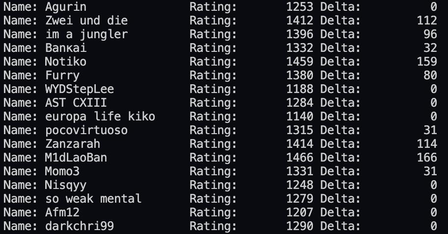
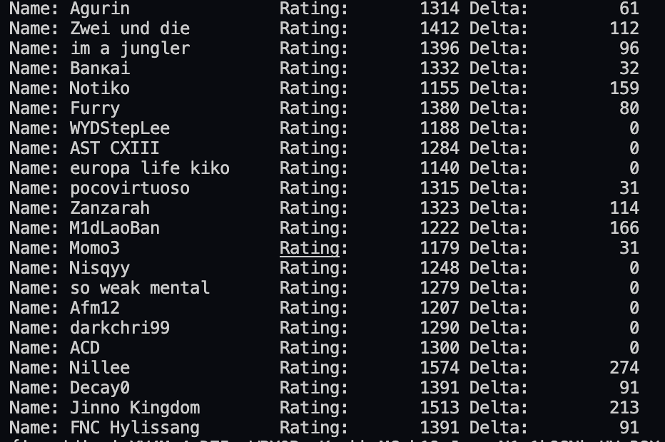

# League of Legends ELO System with Riot API

This is a project for creating an ELO system and leaderboard for League of Legends using the Riot API. The system is designed for monthly/weekly/annual leaderboard tournaments where players join the tournament and play games as usual. The platform tracks the user's played games and statistics, and within 30 days, the 10 best games count in the tournament. Based on these 10 games, the total score is calculated, and the first 16, 32, etc. users are rewarded.

## Features

- ELO System and leaderboard for League of Legends
- The system can be extended to support other games (e.g., CS:GO, PUBG, TFT).
- Teaming recommendation system based on in-game statistics, roles, and queue
- There is a pool of players who want to participate in the "Finder Queue for Teammates" or "Finder Queue for Enemies".

## Implementation

The project is implemented in Python, and the Riot API is used for gathering game statistics. The following features are implemented in the project:

- main.py: This file is the entry point for the project. It calls other functions, gets environment variables, Elo system logic, and sets constants.
- score_functions.py: This file contains calculating expected win rates, distributing rating changes, etc.
- utils.py: This file contains the normalizing player's data, and other required functions.

# Screenshots
## Before

## After

## Getting Started
To use the project, you need to have a Riot API key. You can get one by registering at the Riot Developer Portal.

## Environment Variables
The following environment variables are needed for the project:

- RIOT_API: Your Riot API key.

## Constants
The following constants are used in the project:

- INITIAL_RATING: The initial rating for new players.
- K_FACTOR: The K-factor used for rating changes.
- NUM_GAMES_TO_COUNT: The number of games to count for the leaderboard.
- NUM_LEADERBOARD_WINNERS: The number of users who will be rewarded on the leaderboard.

## Conclusion
This project provides a scalable and flexible ELO system for League of Legends and other games. It also includes a recommendation system for finding teammates and enemies based on game statistics, roles, and queue.